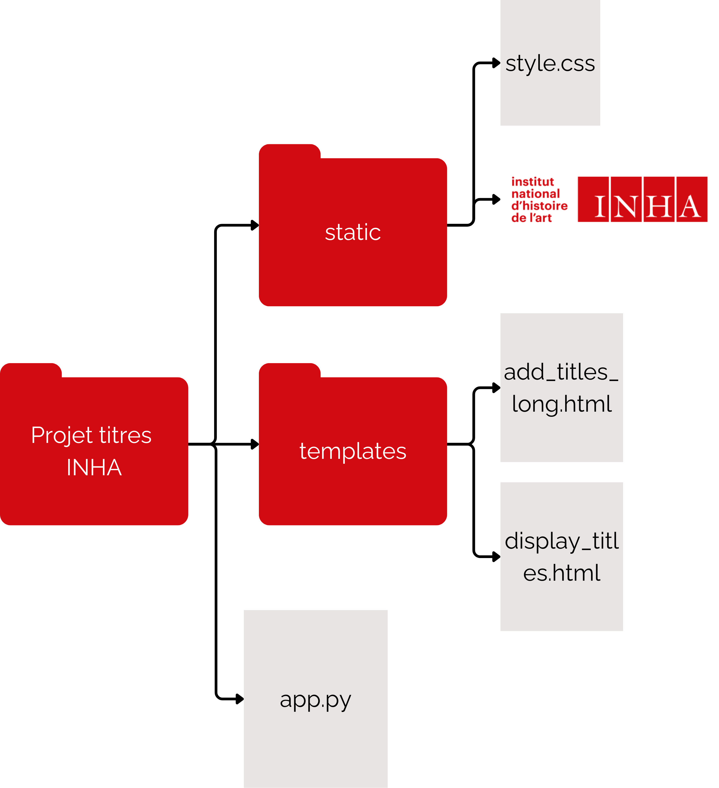

# INHA in short : introduction
- Ce projet est un essai réalisé au cours du printemps 2024, en tant que monitrice étudiante au service de l'informatique documentaire (SID) de l'INHA. Plus particulièrement, il a été effectué dans le cadre de la rédaction de notices pour les catalogues de ventes numrisés à mettre en ligne sur la bibliothèque numérique de l'INHA.
- Le modèle entraîné est disponible sur Hugging Face à cette adresse : https://huggingface.co/JulietteBenguigui142/INHA_in_short
- Projet sous licence MIT et réutilisable librement. Pour plus d'information consulter les termes de la licence. 
# Problématiques et objectifs 
Les catalogues de ventes ont souvent des titres longs et descriptifs, et encore plus quand il s’agit de recueils factices. Pour les afficher de manière plus lisible sur la page des résultats de recherche sur la bibliothèque numérique, ils sont raccourcis.
## Méthode : 
- Agrégation des titres des recueils factices avec le séparateur « \[suivi de] » 
- Titre raccourcis : généralement on garde le début du titre, pour avoir une idée représentative du contenu de la vente, le nom du collectionneur, d’artistes importants s’il y en a. La date est extraite et mise en forme selon la forme suivante : \[vente du N° du jour, mois, année]. Les contenus supprimés sont placés entre crochets. Par exemple :
  
| Titre long | Titre court |
|---------|----------|
|Catalogue des vases, colonnes, tables de marbres rares, figures de bronze, porcelaines de choix, laques, meubles précieux, pendules, lustres, bras & lanternes de bronze doré d'or mat : bijoux & autres effets importants qui composent le cabinet de feu M. le duc d'Aumont. Par P. F. Julliot fils, & A. J. Paillet. La vente se fera le 12 décembre 1782, à quatre heures précises de relevée, & jours suivants, en son hôtel, place Louis XV|Catalogue des effets précieux qui composent le cabinet de feu M. le duc d'Aumont \[...] : \[vente du 12 au 21 décembre 1782]|

## Idées 
- Expérimenter une automatisation à la fois du processus d’agrégation et de titres résumés
- Créer une petite interface graphique qui soit capable, quand on lui donne un ou plusieurs titre de catalogues de ventes, de les agréger ensemble (s'il s'agit d'un recueil factice) et de générer une version abrégée (destinée à un affichage plus clair sur la page des résultats de recherche sur la bibliothèque numérique)
# Agrégation automatique des titres et interface graphique
## Comment ça marche ?
- Python pour effectuer l’opération d’agrégation. Concrètement, ici, c’est ce langage de programmation qui, une fois les titres soumis séparément, les récupère et les agrège en les séparant par le « \[suivi de] »
- HTML pour l’affichage web
- CSS pour « habiller » les pages web
## Comment le réutiliser ?
- Sur ce repository, télécharger en local dans un nouveau dossier le fichier "app.py" et les dossiers "templates" et "static"
- Ouvrir ce nouveau dossier avec un éditeur de code comme VS Code, ouvrir et exécuter le script "app.py"
- Le terminal renvoie une adresse : la copier-coller dans un navigateur et ajouter "add_titles_long" à l'adresse
- On peut maintenant entrer plusieur titres et les agréger ensemble

*Note : cette interface n’est pas spécialement utile en elle-même mais l’idée était de la combiner avec la génération automatique de résumés. On aurait alors eu 2 résultats : les titres longs agrégés (si plusieurs) et les versions résumées à afficher dans la page de résultats*

**Arborescence des fichiers pour utiliser la petite interface web**

  

# Résumés automatiques des titres
## Comment ça marche ?
- Les titres sont résumés selon des modalités qui ne sont pas transmissibles telles quelles à un programme informatique : elles sont trop fines et nécessitent une compréhension humaine (notamment pour retrouver le nom du collectionneur, couper à des moments pertinents, extraire la date).
- L’intelligence artificielle, et plus précisément l’entraînement et le fine-tuning d’un modèle de langue, permet « d’apprendre » à la machine à faire une tâche en lui donnant un grand nombre d’exemples.
- Dans notre cas, les exemples sont des titres « longs » et leurs équivalents résumés : nous en avons plus de 17 000 grâce au travail déjà réalisé pour les catalogues de vente sur la bibliothèque numérique
- Suivi d'un tuto de résumés automatique sur Hugging Face disponible ici : https://huggingface.co/docs/transformers/tasks/summarization
- Le modèle de langue choisi : Google-T5/T5-small
  - Spécialisé dans les tâches de traitement automatique de la langue (NLP en anglais)
  - Langues : anglais, français, roumain et allemand
  - 60 millions de paramètres
  - Mobilisable grâce à la plateforme Hugging Face, qui héberge des modèles de langues et des bases de données
- Nécessité d'un GPU pour effectuer cet entraînement : utilisation de Google Colab et d'un GPU distant.

**Les étapes**
  1. Préparer les données (nettoyage, mise en forme)
  2. Fine-tuning : modifier les paramètres du modèle pour l’adapter au projet
  3. Entraîner : lancer l’opération sur Python (dure une vingtaine de minutes)
  4. Tester avec de nouvelles données

## Les résultats 
**Ce qui a été bien intégré par le modèle**
- Un découpage cohérent (ne coupe pas en plein milieu des phrases) 
- Le format de la date « : \[vente du N° jour mois années] » et l’extraction dans le titre
- La traduction des jours et mois quand c’est nécessaire pour formater la date

**Ce qui a été moins bien intégré**  
- Le nom du collectionneur 
- Le fait de ne pas inventer de date s’il n’y en a pas dans le titre ?
- Les titres longs

**Exemples de titres générés automatiquement par le modèle**

| Titres longs | Titres courts manuels | Titres générés automatiquement |
|--------------|-----------------------|---------------------------------|
| Catalogus numismatum nummorumque tum veterum, tum recentiorum, omnis generis et moduli, quos non minore sumptu, quàm curâ & delectu, collegit. regius princeps ac dux Lotharingiae Carolus Alexander, Austriaci Belgii supremus quondam gubernator. Publica eorumdem auctio & venditio siet Bruxellis decimâ-septimâ septembris & sequentibus diebus anno 1781, pecuniâ cambiali, in Domo Regiâ, Belgicè dictâ Broot-huys, medio decimae ante meridiem, & tertiâ post meridiem | Catalogus numismatum nummorumque \[...] : \[vente du 17 septembre 1781] | Catalogus numismatum nummorumque tum veterumque \[...] : \[vente du 1781] |
| Catalogue des vases, colonnes, tables de marbres rares, figures de bronze, porcelaines de choix, laques, meubles précieux, pendules, lustres, bras & lanternes de bronze doré d'or mat : bijoux & autres effets importants qui composent le cabinet de feu M. le duc d'Aumont. Par P. F. Julliot fils, & A. J. Paillet. La vente se fera le 12 décembre 1782, à quatre heures précises de relevée, & jours suivants, en son hôtel, place Louis XV... | Catalogue des effets précieux qui composent le cabinet de feu M. le duc d'Aumont \[...] : \[vente du 12 au 21 décembre 1782] | Catalogue des vases, colonnes, tables de marbres rares, figures de bronze, porcelaines de choix \[...] : \[vente du 12 décembre 1782] |
| A catalogue of all that valuable and magnificent collection of Italian, French, Flemish, and Dutch pictures, selected with singular taste and admitted judgement, the property of Mr. Bryan, and comprising the original works and great performances of the following masters : Rubens, Vandyke, Titian, Salvator Rosa, Claude Loraine, Berghem, Guido, Nich. Poussin, W. Vandevelde, Philip Wouvermans, Velasquez, Paul Potter... Wich will be sold by auction by Peter Coxe, Burrell, and Foster, at Mr. Bryan's celebrated gallery in Pall Mall, where they are displayed, on Thursday, may 17, 1798, and two following days, at twelve o'clock | Catalogue of all that valuable and magnificent collection [...] the property of Mr. Bryan : \[vente du 17 mai 1798] | Catalogue of all that valuable and magnificent collection of Italian, French, Flemish, and Dutch pictures, selected with singular taste and admitted judgement \[...] : \[vente du 17 mai 1798] |
| Catalogue raisonné d'un choix précieux de dessins, et d'une nombreuse et riche collection d'estampes anciennes et modernes, en feuilles, en recueils et en oeuvres, livres a figures, sciences et arts, tableaux et autres objets curieux, qui composent le cabinet de feu Pierre-François Basan père, graveur & ancien marchand d'estampes. Par L. F. Regnault, peintre & graveur | Catalogue raisonné d'un choix précieux de dessins [...] qui composent le cabinet de feu Pierre-François Basan : \[vente du 1er au 19 décembre 1798] | Catalogue raisonné d'un choix précieux de dessins \[...] : \[vente du 1er avril 1939] |
| Catalogue du cabinet de feu Mr. Henri Tersmitten, en son vivant bourgemaitre & conseiller de la ville d'Amsterdam, & commissaire pour les postes de LL. NN. & GG. puissances les Etats de Hollande & de Westfriese, &c. &c. &c. renfermant une collection très-considérable de desseins & d'estampes des plus grands maitres, tant italiens que françois, flamans & hollandois. Avec un appendix de diverses curiosités. Cette vente se fera le lundi 23. septembre 1754. & jours suivants, chez Jean Volbragt, à la Couronne impériale dans la rue nommée le Kalverstraat | Catalogue du cabinet de feu Mr. Henri Tersmitten \[...] : \[vente du 23 septembre 1754] | Catalogue du cabinet de feu Mr. Henri Tersmitten, en son vivant bourgemaitre et conseiller de la ville d'Amsterdam \[...] : \[vente du 23 septembre 1754] |

## Comment le réutiliser ?
- Aller sur le Jupyter Notebook "summary_inha.ipynb" et cliquer sur "Ouvrir dans Collab"
- Se rendre tout en bas du Notebook et exécuter la cellule "text = input()"
- Rentrer son titre long, cliquer sur Entrer
- Exécuter la cellule juste en dessous : le titre court va être généré ! 
# Conclusion
**Succès** 
- La création d’une petite interface graphique et l’interaction de contenus html, css et scripts Pythons pour l’agrégation des titres entre eux (pour les recueils factices)
- L’entraînement / le fine-tuning d’un modèle d’intelligence artificielle dédié à la génération de résumés
- Un début de « compréhension » du modèle 
- Utilisation de Github et HuggingFace, deux interfaces qui permettent de gérer, stocker et utiliser des projets informatiques et IA

**Échecs / voix d’amélioration**
- Le déploiement du modèle entraîné au-delà du script python pour une utilisation généralisée : dû notamment à l'impossibilité d'entraîner le modèle localement sans GPU
- Des résultats pas assez satisfaisants pour être exploitables dans la bibliothèque numérique 
- Correspond à une version 1, nécessite encore du travail, à la fois sur les données d’entraînement et sur les paramètres du modèle

